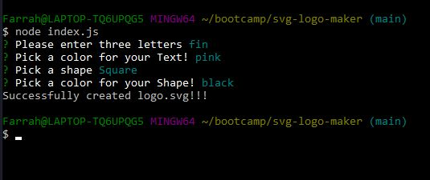
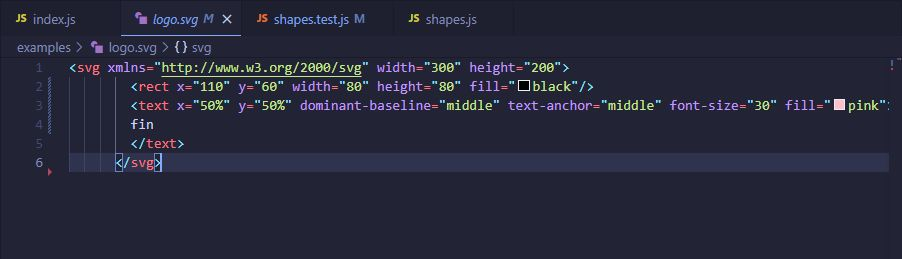

# Svg Logo Maker

## Description
This application uses the command line to quickly generate a new svg logo! When prompted for information about your logo, the application accepts your input and produces a logo.svg file with your chosen shape (circle, triangle, or square), shape color, and text color.

From the command line, this application also uses Jest to test it's performance. 

## Table of Contents
- [Installation](#installation)
- [Usage](#usage)
- [Video](#video)
- [Screenshots](#Screenshots)
- [Credits](#credits)
- [Tests](#tests)
- [License](#license)

## Installation
Clone the repository: **git clone https://github.com/Firene11/svg-logo-maker.git**

Open the repository in your code editor such as VS Code. Open the terminal and make sure you’re in the root directory.

## Usage
From the command line in your terminal run the commmand:

**node index.js**

Answer the prompted questions about your logo. When all questions are answered, a generated logo.svg file will be produced in the examples folder. You may rename the file in the folder so that you can generate and write more logo files!

## Video

**Watch this VIDEO to see how the app runs and tests!**

[Watch this brief video to see how it works](https://drive.google.com/file/d/14Oaowj3uehFyVMunK8R03o3p-Jemd3tI/view)

## Screenshots
Application

 

SVG generated

 

SVG code

 

Test (Jest)

 

## Credits
n/a

## Tests

This application uses Jest for running the unit tests and Inquirer for collecting input from the user. The test is invoked by using the following command:

**npm test**

All tests pass.

## License
none
